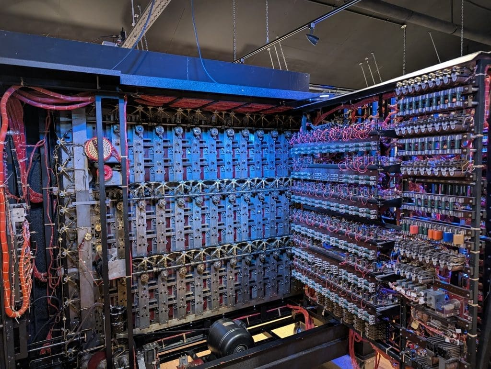

# Imagination Machines

`Imagination Machines` is a 4-week, 8-lesson course where first-time coders discover how to transform ideas into working software through hands-on exploration.

You'll start with puzzles, not lectures. Each week you'll encounter a set of mysteries to puzzle through. You'll figure out how to fix each problem, then understand the principles behind your solution.

By course end, you'll have constructed a complete browser-based rock-paper-scissors game by mastering four essential parts of software: mental models (how to think about systems), decision logic (how computers choose), user interfaces (how people interact), and integration (how everything connects). 

You'll discover that software is simply imagination made real through code - an Imagination Machine!

## 🙌 Goal
Build confidence in your ability to create interactive software by:
- **Reverse-engineering**: Figuring out what mysterious code samples actually do through experimentation
- **Problem-solving**: Debugging broken game logic, UI, and connections before learning the "right" way  
- **System thinking**: Creating diagrams that show how code creates behavior
- **User experience**: Building interfaces that feel natural and responsive

## 🤔 Learning Outcomes
By course completion, students will:
- [ ] Build a functional rock-paper-scissors game that can be played in-browser 
- [ ] Create system diagrams showing data flow and user interactions
- [ ] Debug code 
- [ ] Design and implement simple interactive user interfaces

## 📚 Technology Stack

We will use the VSCode IDE for this course. 
- **Docker**: Provides a consistent environment (used as a black box)
- **HTML**: Single file for displaying the game interface
- **CSS**: Single file for styling and layout
- **JavaScript**: Single file for game logic and interactivity

**Why this stack?** These technologies teach core programming concepts that transfer to any language or framework. Once you understand variables, functions, and user interaction patterns, you can apply these ideas whether you're building mobile apps, web services, or data analysis tools.

**Future paths**: The thinking patterns you'll develop here translate directly to:
- **Frontend**: React, Vue, Angular for complex web applications
- **Backend**: Node.js, Python, Java for server-side development
- **Mobile**: Swift, Kotlin, React Native for mobile apps
- **Data**: Python, R, SQL for analysis and machine learning

The language doesn't matter - the problem-solving approach does.

## ❗What We Won't Cover

Given our focus on core thinking patterns, we'll skip:
- Version control (Git) - important for teams, not for learning logic
- Deployment - focus is on building, not publishing
- Testing frameworks - you'll debug by experimentation instead
- Development workflows - we'll keep it simple and direct

You'll gain the foundational thinking that makes learning these tools straightforward later.

---
## 🗺 Course Outline
- For each week, please see the relevant folder's `README.md` file.
- Each week's puzzle, etc will be issued on the Monday class.

### Week 0: setup
This is basic setup for the course. 
Please read through and complete before the first class.

### Week 1: What Does This Thing Do?
> Ideas as Abstract Machines

**The Mystery**: Students get 3 working code samples (no explanation) and must figure out what each does through experimentation.

Monday (Do First):
- 0-45min: Reverse-engineer mystery code samples
- 45-90min: Draw diagrams of what you think is happening

Tuesday (Learn Later):
- 0-30min: Share discoveries, compare diagrams  
- 30-60min: Introduce abstraction concepts
- 60-90min: Design your own game system diagram

**Takehome**: Create a system diagram for rock-paper-scissors (no code yet).

### Week 2: Why Won't This Decide?"
> Logical Machines

**The Mystery**: Students get broken decision-making code that can't choose rock/paper/scissors properly.

Monday (Do First):
- 0-45min: Debug broken game logic puzzles
- 45-90min: Try to make the computer "think"

Tuesday (Learn Later):
- 0-30min: What did you discover about making decisions?
- 30-60min: Variables, functions, conditionals revealed
- 60-90min: Build working game logic in console

**Takehome**: Complete rock-paper-scissors logic (console-based)

### Week 3: "Why Can't I Touch It?" 
> Interacting with an idea

**The Mystery**: Students have working logic but no way for humans to interact with it.

Monday (Do First):
- 0-45min: Broken UI repair challenges
- 45-90min: Make buttons that do... something

Tuesday (Learn Later):
- 0-30min: How did you connect human actions to code?
- 30-60min: HTML, CSS, DOM events explained
- 60-90min: Build clickable interface

**Takehome**: Create UI for your game (no logic connection yet)

### Week 4: "Why Are These Two Things Ignoring Each Other?"
> Connecting the two parts

**The Mystery**: Students have working logic AND working UI, but they don't talk to each other.

Monday (Do First):
- 0-45min: Integration debugging puzzles
- 45-90min: Make your button clicks actually play the game

Tuesday (Learn Later):
- 0-30min: How did you wire them together?
- 30-60min: Event handling and state management
- 60-90min: Add difficulty levels and polish

**Takehome**: Complete integrated game. Followup TBC.

### Q&A
- Any questions will be submitted onto the discussion board of this repo: https://github.com/lennardong/imagination_machines/discussions

## 👋 About the Instructor

Hi, I'm Lennard. 
I'm here to share the joy of building things through code with you.

Some bullets:
- I like building things.
- I spent 10 years building buildings, now I build software. 
- My specialization is in Backend Systems & Machine Learning.

If it really matters...
- my LinkedIn: https://www.linkedin.com/in/lennardong/
- my personal website: https://lennardong.com/

