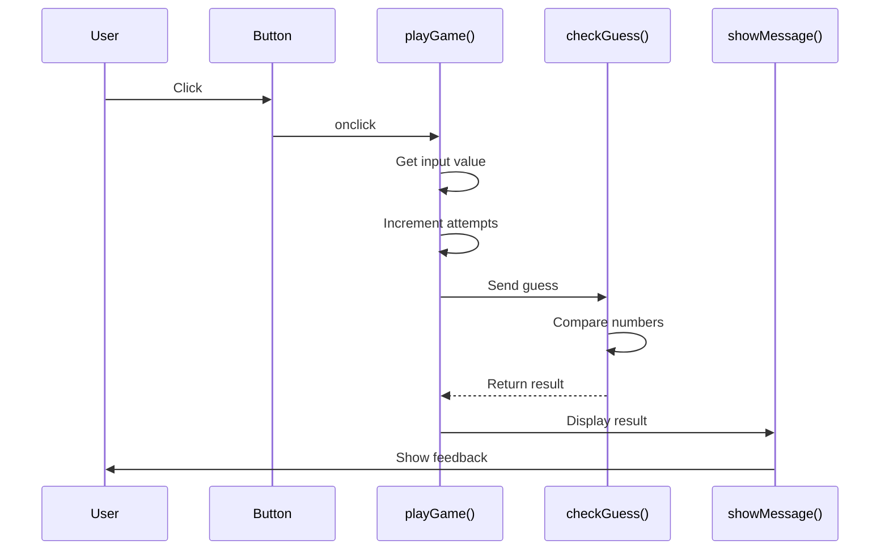

# Week 1: Code Detective Guide
## Your Mission: Figure Out What These Games Do!

---

## 🔍 Puzzle 1: Mystery Game (Read-Only)
**Time:** 30 minutes  
**Challenge:** Figure out what this game does WITHOUT running it!
### Your Detective Tools:
#### 🎯 Starting Clues - Look For These:
1. **Variables (Information Storage)**
   - Look for the word `let`
   - What comes after `let` is a container holding information
   - Write down each variable name and guess what it stores
1. **Functions (Action Blocks)**
   - Look for the word `function`
   - Functions have names that hint at what they do
   - Functions are like mini-programs inside the big program
1. **Comparisons (Decision Points)**
   - Look for symbols: `>` (greater than), `<` (less than), `===` (equals)
   - These are where the computer makes choices
### 🤔 Investigation Questions:

**Question 1:** Find the Secret
- [ ] Look for `let secretNumber =` 
- [ ] What number is the computer thinking of? _______
- [ ] Is this number always the same? _______

**Question 2:** Understand the Flow
- [ ] Find the function called `playGame()`
- [ ] List three things this function does:
  1. _________________________________
  2. _________________________________
  3. _________________________________
**Question 3:** Decision Logic
- [ ] Find the function `checkGuess()`
- [ ] What goes IN (hint: look in parentheses)? _______
- [ ] What comes OUT (hint: look for `return`)? _______
**Question 4:** Game Limits
- [ ] Find `maxAttempts`
- [ ] How many tries does the player get? _______
- [ ] What happens when attempts run out? _______
### 📊 Draw Your Diagram:
#### Diagram Shape Legend:
```
⭕ or ( ) = Start/End points
▢ or [ ] = Process/Action
◇ or < > = Decision (yes/no question)
→ ↓ ← ↑ = Flow direction
```

Use this space to draw how you think the game works:
```
START → [________] → [________] → <________?> → [________] → END
                                      ↓ No
                                   [________]
```

### 💡 Hypothesis:
I think this game is: _________________________________

---
## 🎮 Puzzle 2: Mystery Game (Interactive) - Chain Pattern
**Time:** 30 minutes  
**Challenge:** Run it, play it, then modify it!

### 🎯 New Patterns to Discover:
**The game got more complex! Look for:**
- More variables at the top (the game's "memory")
- Functions that call other functions (like dominoes)
- `currentRound` and `maxRounds` (multiple chances to play)
- Arrays: `[]` (lists that remember things)

### 🤔 Investigation Questions:
**Question 1:** What's New?
- [ ] Count the variables at the top. How many now? _______
- [ ] What does `score` keep track of? _______
- [ ] What does `currentRound` do? _______

**Question 2:** The Function Chain
- [ ] Find `startChain()` - what function does it call? _______
- [ ] That function calls another - which one? _______
- [ ] Follow the chain - how many functions in total? _______

**Question 3:** Scoring System
- [ ] Play the game and win in 1 guess. Score: _______
- [ ] Play again and win in 3 guesses. Score: _______
- [ ] What's the pattern? _______

### 🔧 Modification Challenges:
Try these changes and see what happens:
1. **Easy Mode:**
   - In `setupRound()`, change the 3 in `attempts >= 3` to 5
   - What happened? _______
1. **Bigger Range:**
   - Change `if (currentRound === 2) maxNumber = 20` to `= 50`
   - What changed? _______
1. **Visual Change:**
   - In the CSS, change `background: #f4f4f9` to `#ffcccc`
   - What color did it become? _______
1. **More Points:**
   - Find `(4 - attempts) * 10` and change 10 to 20
   - How does scoring change? _______

### 📊 Function Chain Diagram:
Draw how functions call each other:

```
[Button Click] → [startChain] → [?] → [?] → [?] → [End]
```

### 📋 Sequence Diagrams

#### Example: Puzzle 1 Simple Flow
Here's how to draw what happens when someone plays:

```
User        Button      playGame()    checkGuess()    Display
 |            |            |              |              |
 |--Click---->|            |              |              |
 |            |--Call----->|              |              |
 |            |            |--Get input-->|              |
 |            |            |              |              |
 |            |            |<--"Too high"-|              |
 |            |            |              |              |
 |            |            |--Show--------|------------->|
 |            |            |              |              |
 |<-----------|------------|--------------|----Result----|
```

#### Your Turn: Draw Puzzle 2's Sequence
Show how the chain of functions works:

```
User        startChain    captureGuess    checkGuess    displayFeedback
 |             |              |              |              |
 |--Click----->|              |              |              |
 |             |--?---------->|              |              |
 |             |              |--?---------->|              |
 |             |              |              |--?---------->|
 (continue...)
```
---

## 🏆 Puzzle 3: Different Design Pattern!
**Time:** 10 minutes  
**Challenge:** Same game, different thinking!

### 🎯 Speed Investigation:
**Find the Controller:**
Look for `gameController()` - it's like a traffic controller!

**Quick Questions:**
1. How many times does `gameController` appear? _____
2. What are the different "actions" it can take? List them:
   - _________________
   - _________________
   - _________________
   - _________________

### 🔍 HTML/JS Connection Discovery:
**The Button Mystery:**
Look at the HTML file and find all the `<button>` elements.

**Investigation Questions:**
1. How many buttons are in the HTML? _______
2. Each button has `onclick="gameController('???')"` - what word is in the quotes for each?
   - Button 1: _________________
   - Button 2: _________________
   - Button 3: _________________
   - Button 4: _________________
3. Can you see ALL buttons at the same time? _______
4. What happens if you click "Next Round" before guessing? _______

### 🎨 CSS & Visual Experiments:
**Challenge 1: Button Color Change**
- In the CSS, find `button { background: #c9a88c; }`
- Change `#c9a88c` to `green` (or any colour... give it a try)
- What happened to ALL the buttons? _______

**Challenge 2: Out-of-Order Clicking**
- Start the game and immediately click "End Game"
- What happens? _______
- Click "Submit Guess" without typing a number
- What message appears? _______
- Click "Next Round" without making any guesses
- Does it work? What does this tell you? _______

**Challenge 3: Change Button Names**
- In the HTML, change `Submit Guess` to `Check My Number`
- Does the game still work? _______
- What does this tell you about button text vs `onclick`? _______

**Challenge 4: Game State Discovery**
- Look for the variable `gameActive` in the JS
- When is it `true`? When is it `false`? _______
- How does this protect the game from "wrong" clicks? _______


**Challenge 5: Sequence Diagram**
- Try draw the sequence diagram. Remember: make function names the top box and indicae its input.

### 🤯 Big Discovery:
Both games do the SAME THING but are organized DIFFERENTLY!
- Which way makes more sense to you? _______
- Why? _________________________________

**Bonus Discovery:** The HTML creates ALL the buttons, and JavaScript makes sure they work correctly no matter when you click them!

---

---

## 📋 End of Tuesday Reflection

**Three things I learned:**
1. _________________________________
2. _________________________________
3. _________________________________

**Two things that surprised me:**
1. _________________________________
2. _________________________________

**One question I still have:**
_________________________________

**HTML/JS/CSS Connections I discovered:**
_________________________________

**My confidence level reading code:**
😟 1 —— 2 —— 3 —— 4 —— 5 😄

---

## 🎯 Success Checklist

By the end of today, you should be able to:
- [ ] Identify variables (containers for information)
- [ ] Spot functions (action blocks)
- [ ] Recognize comparisons (decision points)
- [ ] Understand that functions need to be called to run
- [ ] See how games use state (memory) to track progress
- [ ] Draw a basic flowchart of a program
- [ ] Draw a sequence diagram showing function calls
- [ ] Make simple modifications to existing code
- [ ] Connect visual changes to code changes
- [ ] Recognize different ways to organize the same logic
- [ ] **NEW:** Understand how HTML buttons connect to JavaScript functions
- [ ] **NEW:** See how the game protects itself from "wrong" button clicks
- [ ] **NEW:** Realize button text is separate from button behavior

**Remember:** You don't need to understand every line! Focus on the big picture - how the pieces work together to create a game.

---

## 🚀 Going Further (Optional)

### Sequence Diagram Challenge

Here's a sequence diagram for Puzzle 1:



**Challenge:** Create sequence diagrams for:
1. Puzzle 2 (Chain Pattern) - Show how each function calls the next
2. Puzzle 3 (Orchestrator) - Show how controller manages everything AND how buttons appear/disappear

### Pattern Hunting:
Count how many times these appear in the code:
- `function`: _____ times
- `if`: _____ times
- `let`: _____ times
- `return`: _____ times
- `gameActive`: _____ times

### Variable Tracking:
Pick one variable (like `score`) and highlight every place it appears. This shows you its "lifecycle."

### CSS Detective Work:
1. Change the font size in `.value { }` by adding `font-size: 24px;`
2. Add `border-radius: 10px;` to the button style
3. What shapes did the buttons become? _______
4. Notice: CSS only controls appearance, not behavior!

---

## 💬 Discussion Starters

Use these to talk with your partner:

- "I think this part does..."
- "The chain pattern feels like..."
- "The orchestrator pattern feels like..."
- "What happens if we change..."
- "The pattern I see is..."
- "The difference between Puzzle 2 and 3 is..."
- "The HTML creates ___ but JavaScript controls ___"
- "CSS is for ___ while JavaScript is for ___"
- "When I click the wrong button, the game ___"

---

# For Next Week
## Homework 1: Reading & Reflection
Read https://www.teamten.com/lawrence/programming/intro/
Chapters: 1, 2, 3, 10

### Chapter 1 Questions:
1. **The Time Machine Question**: If you could go back to 1950 and had to explain what a "program" is to someone who's never seen a computer, using only things that existed then (typewriters, recipe cards, telephone operators), how would you do it? Why do you think those analogies work?

2. **The Alien Perspective**: Imagine an alien visits Earth and asks "Why do humans make machines do their thinking for them?" Based on Chapter 1, what would be your answer? What does this tell you about the relationship between human thinking and computer thinking?

### Chapter 2 Questions:
1. **The Magic Wand Problem**: If you had a magic wand that could change ONE thing about how programming languages work to make them easier for beginners, what would you change and why? What trade-offs might your change create for experienced programmers?

2. **The Teaching Challenge**: Why do you think the author chose the specific examples they did in this chapter? If you were teaching your younger sibling to code, would you use the same examples or different ones? What makes a good first example?

### Chapter 3 Questions:
- **Step into the mindset of a language designer:** Let’s think about why different programming languages use different symbols or rules for the same idea (like string concatenation). What might language designers be trying to optimize for?
- **Imagine you’re teaching a robot to follow instructions:** Let’s think about how strict syntax rules in programming compare to the way we use language in everyday conversation. Why do you think computers need such precise instructions?
- **Shift from natural language to programming language:** Let’s think about how you would explain the concept of “syntax” in programming to someone who’s only ever written in natural languages (like English or Chinese). What examples or analogies would help them understand?

### Chapter 10 Questions:
- **Shift into the mindset of a systems builder:** Let’s think about why functions are useful in programming. How do they help make your code easier to understand and maintain?
- **Imagine scaling from a single task to a complex project:** Let’s think about what could go wrong if you don’t use functions and just copy-paste the same code everywhere. What problems might this create as your program gets bigger?
- **Step into the shoes of a teacher or explainer:** Let’s think about how you would explain the idea of a function to someone who’s never coded before. What real-life examples could you use to help them understand?
---

## 📝 Homework 2: Design Rock-Paper-Scissors

Using what you learned this week, create a diagram for Rock-Paper-Scissors.

### Required Elements in Your Diagram:

Use these concepts from this week:
- [ ] **Variables** to store choices and scores (including player name!)
- [ ] **Functions** to handle game logic
- [ ] **Comparisons** to determine winners
- [ ] **State** to remember scores between rounds

### Your Flowchart Should Include:

- [ ] **Start point** (game begins)
- [ ] **Get player name** (store for the whole game)
- [ ] **Get player choice** (rock/paper/scissors)
- [ ] **Generate computer choice** (random)
- [ ] **Compare choices** (who wins?)
- [ ] **Update score** (add points)
- [ ] **Check rounds** (game over?)
- [ ] **End point** (show final score with player name)

### Diagram Symbols to Use:
```
( ) = Start/End (ovals)
[ ] = Process (rectangles)  
< > = Decision (diamonds)
→ ↓ = Flow arrows
```

### Think About:
- What patterns from the number guessing game apply here?
- Would you use a chain pattern or orchestrator pattern? Why?
- How would you handle ties?
- How do you compare rock vs paper vs scissors?
- What buttons would you need in the HTML?
- Should all buttons be visible all the time? Why or why not?
- How would you prevent invalid moves (like choosing twice)?

### 🌟 BONUS CHALLENGE: Personalization
**Extend your game design to include:**

1. **Player Name Features:**
   - Where would you store the player's name? (Which variable?)
   - When would you ask for it? (Beginning? Or allow changes?)
   - How would you use it? (Welcome message? Score display? Taunts?)
   
2. **Extra Credit Ideas (pick one to diagram):**
   - Add a "Best of X rounds" option where player chooses how many rounds
   - Include win/loss/tie statistics (e.g., "Sarah won 60% of rounds!")
   - Add difficulty levels where computer might favor certain choices
   - Create a two-player mode where players take turns

3. **UI Considerations:**
   - Draw a simple sketch of your buttons and text display areas
   - Where would the player name appear on screen?
   - Would you add an "Edit Name" button? Why or why not?

**Bonus Diagram Requirements:**
- Show where the name gets stored (variable)
- Show at least 2 places the name gets used (display)
- Include one "nice touch" that makes the game feel personal

Example personal touches:
- "Great choice, Sarah!"
- "Alex's Score: 5"
- "Computer wins this round, David. Try again!"

Remember: The goal isn't to code this yet - just to THINK about how you'd organize it. Your diagram is your blueprint!

---

## 🚀 Ready for Week 2?

Next week you'll get BROKEN rock-paper-scissors code. Your job will be to fix it using everything you learned today. Your diagram homework will be your map!

**Pro tip:** The bugs will be in:
- Decision logic (who wins)
- Score tracking (keeping points)
- Game flow (what happens when)
- Maybe even HTML/JS connections!

Today's detective work is tomorrow's debugging superpower! 🦸