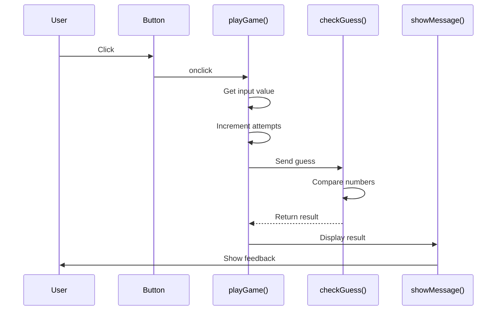

# Week 1: Code Detective Guide
## Your Mission: Figure Out What These Games Do!

---

## 🔍 Puzzle 1: Mystery Game (Read-Only)
**Time:** 30 minutes  
**Challenge:** Figure out what this game does WITHOUT running it!
### Your Detective Tools:
#### 🎯 Starting Clues - Look For These:
1. **Variables (Information Storage)**
   - Look for the word `let`
   - What comes after `let` is a container holding information
   - Write down eachvariable name and guess what it stores
1. **Functions (Action Blocks)**
   - Look for the word `function`
   - Functions have names that hint at what they do
   - Functions are like mini-programs inside the big program
1. **Comparisons (Decision Points)**
   - Look for symbols: `>` (greater than), `<` (less than), `===` (equals)
   - These are where the computer makes choices
### 🤔 Investigation Questions:

**Question 1:** Find the Secret
- [ ] Look for `let secretNumber =` 
- [ ] What number is the computer thinking of? _______
- [ ] Is this number always the same? _______

**Question 2:** Understand the Flow
- [ ] Find the function called `playGame()`
- [ ] List three things this function does:
  1. _________________________________
  2. _________________________________
  3. _________________________________
**Question 3:** Decision Logic
- [ ] Find the function `checkGuess()`
- [ ] What goes IN (hint: look in parentheses)? _______
- [ ] What comes OUT (hint: look for `return`)? _______
**Question 4:** Game Limits
- [ ] Find `maxAttempts`
- [ ] How many tries does the player get? _______
- [ ] What happens when attempts run out? _______
### 📊 Draw Your Diagram:
#### Diagram Shape Legend:
```
⭕ or ( ) = Start/End points
□ or [ ] = Process/Action
◇ or < > = Decision (yes/no question)
→ ↓ ← ↑ = Flow direction
```

Use this space to draw how you think the game works:
```
START → [________] → [________] → <________?> → [________] → END
                                      ↓ No
                                   [________]
```

### 💡 Hypothesis:
I think this game is: _________________________________

---
## 🎮 Puzzle 2: Mystery Game (Interactive) - Chain Pattern
**Time:** 30 minutes  
**Challenge:** Run it, play it, then modify it!

### 🎯 New Patterns to Discover:
**The game got more complex! Look for:**
- More variables at the top (the game's "memory")
- Functions that call other functions (like dominoes)
- `currentRound` and `maxRounds` (multiple chances to play)
- Arrays: `[]` (lists that remember things)

### 🤔 Investigation Questions:
**Question 1:** What's New?
- [ ] Count the variables at the top. How many now? _______
- [ ] What does `score` keep track of? _______
- [ ] What does `currentRound` do? _______

**Question 2:** The Function Chain
- [ ] Find `startChain()` - what function does it call? _______
- [ ] That function calls another - which one? _______
- [ ] Follow the chain - how many functions in total? _______

**Question 3:** Scoring System
- [ ] Play the game and win in 1 guess. Score: _______
- [ ] Play again and win in 3 guesses. Score: _______
- [ ] What's the pattern? _______

### 🔧 Modification Challenges:
Try these changes and see what happens:
1. **Easy Mode:**
   - In `setupRound()`, change the 3 in `attempts >= 3` to 5
   - What happened? _______
1. **Bigger Range:**
   - Change `if (currentRound === 2) maxNumber = 20` to `= 50`
   - What changed? _______
1. **Visual Change:**
   - In the CSS, change `background: #f4f4f9` to `#ffcccc`
   - What color did it become? _______
1. **More Points:**
   - Find `(4 - attempts) * 10` and change 10 to 20
   - How does scoring change? _______

### 📊 Function Chain Diagram:
Draw how functions call each other:

```
[Button Click] → [startChain] → [?] → [?] → [?] → [End]
```

---

## 🏆 Puzzle 3: Different Design Pattern!
**Time:** 10 minutes  
**Challenge:** Same game, different thinking!
### 🎯 Speed Investigation:
**Find the Controller:**
Look for `gameController()` - it's like a traffic controller!

**Quick Questions:**
1. How many times does `gameController` appear? _____
2. What are the different "actions" it can take? List them:
   - _________________
   - _________________
   - _________________
   - _________________

**Spot the Difference:**
How is this different from Puzzle 2's chain?
- Puzzle 2: Functions call the next function
- Puzzle 3: _________________________________
### 🤯 Big Discovery:
Both games do the SAME THING but are organized DIFFERENTLY!
- Which way makes more sense to you? _______
- Why? _________________________________


---
## 📐 Sequence Diagrams

### Example: Puzzle 1 Simple Flow
Here's how to draw what happens when someone plays:

```
User        Button      playGame()    checkGuess()    Display
 |            |            |              |              |
 |--Click---->|            |              |              |
 |            |--Call----->|              |              |
 |            |            |--Get input-->|              |
 |            |            |              |              |
 |            |            |<--"Too high"-|              |
 |            |            |              |              |
 |            |            |--Show--------|------------->|
 |            |            |              |              |
 |<-----------|------------|--------------|----Result----|
```

### Your Turn: Draw Puzzle 2's Sequence
Show how the chain of functions works:

```
User        startChain    captureGuess    checkGuess    displayFeedback
 |             |              |              |              |
 |--Click----->|              |              |              |
 |             |--?---------->|              |              |
 |             |              |--?---------->|              |
 |             |              |              |--?---------->|
 (continue...)
```

---

## 📋 End of Tuesday Reflection

**Three things I learned:**
1. _________________________________
2. _________________________________
3. _________________________________

**Two things that surprised me:**
1. _________________________________
2. _________________________________

**One question I still have:**


**My confidence level reading code:**
😟 1 ——— 2 ——— 3 ——— 4 ——— 5 😄

---

## 🎯 Success Checklist

By the end of today, you should be able to:
- [ ] Identify variables (containers for information)
- [ ] Spot functions (action blocks)
- [ ] Recognize comparisons (decision points)
- [ ] Understand that functions need to be called to run
- [ ] See how games use state (memory) to track progress
- [ ] Draw a basic flowchart of a program
- [ ] Draw a sequence diagram showing function calls
- [ ] Make simple modifications to existing code
- [ ] Connect visual changes to code changes
- [ ] Recognize different ways to organize the same logic

**Remember:** You don't need to understand every line! Focus on the big picture - how the pieces work together to create a game.

---

## 🚀 Going Further (Optional)

### Sequence Diagram Challenge

Here's a sequence diagram for Puzzle 1:



**Challenge:** Create sequence diagrams for:
1. Puzzle 2 (Chain Pattern) - Show how each function calls the next
2. Puzzle 3 (Orchestrator) - Show how controller manages everything
### Pattern Hunting:
Count how many times these appear in the code:
- `function`: _____ times
- `if`: _____ times
- `let`: _____ times
- `return`: _____ times
### Variable Tracking:
Pick one variable (like `score`) and highlight every place it appears. This shows you its "lifecycle."

---

## 💬 Discussion Starters

Use these to talk with your partner:

- "I think this part does..."
- "The chain pattern feels like..."
- "The orchestrator pattern feels like..."
- "What happens if we change..."
- "The pattern I see is..."
- "The difference between Puzzle 2 and 3 is..."

---

# For Next Week

## 📝 Homework: Design Rock-Paper-Scissors

Using what you learned this week, create a diagram for Rock-Paper-Scissors.

### Required Elements in Your Diagram:

Use these concepts from this week:
- [ ] **Variables** to store choices and scores
- [ ] **Functions** to handle game logic
- [ ] **Comparisons** to determine winners
- [ ] **State** to remember scores between rounds

### Your Flowchart Should Include:

- [ ] **Start point** (game begins)
- [ ] **Get player choice** (rock/paper/scissors)
- [ ] **Generate computer choice** (random)
- [ ] **Compare choices** (who wins?)
- [ ] **Update score** (add points)
- [ ] **Check rounds** (game over?)
- [ ] **End point** (show final score)

### Diagram Symbols to Use:
```
( ) = Start/End (ovals)
[ ] = Process (rectangles)  
< > = Decision (diamonds)
→ ↓ = Flow arrows
```

### Think About:
- What patterns from the number guessing game apply here?
- Would you use a chain pattern or orchestrator pattern? Why?
- How would you handle ties?
- How do you compare rock vs paper vs scissors?

---

## 🏁 Ready for Week 2?

Next week you'll get BROKEN rock-paper-scissors code. Your job will be to fix it using everything you learned today. Your diagram homework will be your map!

**Pro tip:** The bugs will be in:
- Decision logic (who wins)
- Score tracking (keeping points)
- Game flow (what happens when)

Today's detective work is tomorrow's debugging superpower! 🦸