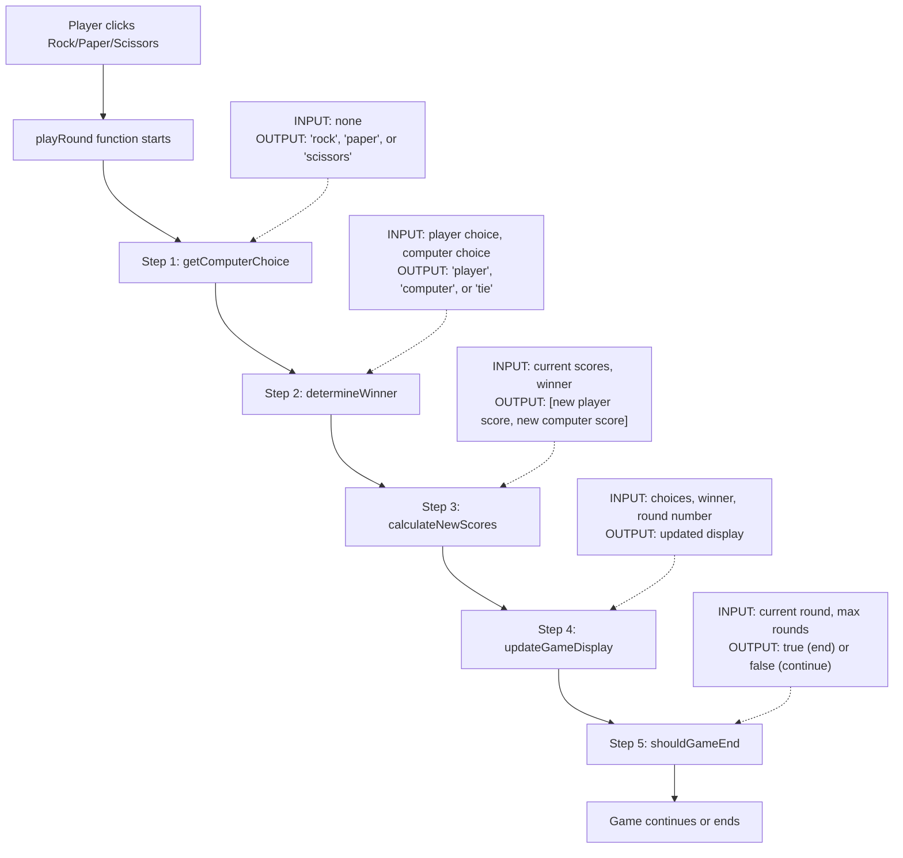

# Week 2 Homework: Your First Debugging Adventure!
## Fixing the Broken Rock-Paper-Scissors Game

---

## Understanding the Code Pattern: Pipeline Style 🔧

Your Rock-Paper-Scissors game uses a **Pipeline Pattern** - like a factory assembly line where each step takes specific inputs and produces specific outputs. This makes the code easier to understand and debug!

### How the Pipeline Works



### What This Means for You

Each function is like a kitchen helper with a specific job:
- **Clear Inputs:** What information does it need?
- **Clear Outputs:** What does it give back?
- **One Job:** Each function does exactly one thing

This makes bugs easier to find because you can test each step separately!

### Pipeline Debugging Strategy

Just like in Chef Maria's kitchen puzzles, you can test each pipeline step:

1. **Check the Input:** What did this function receive?
2. **Check the Output:** What did it return?
3. **Expected vs Actual:** Is the output what you expected?

```javascript
// Example: Testing the winner determination step
console.log("INPUT: Player chose rock, Computer chose scissors");
let result = determineWinner("rock", "scissors");
console.log("OUTPUT: " + result);
console.log("EXPECTED: player should win");
```

**Pipeline Benefits for Debugging:**
- ✅ Test one step at a time
- ✅ Clear error messages show which step failed
- ✅ Fix one function without breaking others
- ✅ Easy to understand what each part does

---

## Welcome Back, Code Detectives! 🔍

Last week, you explored mysterious number guessing games and learned to:
- Read code like a detective
- Spot variables, functions, and decisions
- Draw diagrams showing how programs flow
- See different patterns (chain vs orchestrator)

This week, we're putting those detective skills to work! You'll receive a **broken** Rock-Paper-Scissors game and fix it step by step, using the same debugging techniques you learned in Chef Maria's kitchen puzzles.

---

## Your Mission

You have a Rock-Paper-Scissors game called "BrokenScissorPaperStone" that has several bugs. Your job is to:
1. Play the game to discover what's broken
2. Find the bugs in the code using console debugging
3. Fix them one at a time using FLAG comments
4. Make the game work properly!

Remember: You're not writing new code from scratch - you're fixing existing code. Much easier!

---

## Learning Objectives

By completing this homework, you will:
1. **Practice reading code** to understand what it's trying to do
2. **Identify bugs** by comparing what happens vs. what should happen
3. **Make simple fixes** by changing values and logic
4. **Test your solutions** by playing the game after each fix
5. **Build confidence** that you can understand and fix code!
6. **Apply puzzle debugging skills** to a real game project

---

## Before You Start

### What You'll Need:
- Your broken game files (HTML and JavaScript)
- Your notes from Week 2 puzzles (especially about console debugging)
- Browser developer tools (console)
- Patience and detective spirit!

### How to Test Your Game:
1. Open the HTML file in your browser
2. **Open the console** (F12, then click "Console" tab) - just like in the puzzles!
3. Play a few rounds
4. Notice what's wrong
5. Use console messages and FLAG comments to find bugs
6. Make a fix in the code
7. Refresh your browser
8. Test if it's better!

### Console Debugging (From Your Puzzles!)
Remember from Chef Maria's kitchen: the console is your debugging friend!
- Look for `console.log()` messages that show what's happening **at each pipeline step**
- Check for error messages in red
- Use `checkMyWork()` functions to verify your fixes
- Just like in the puzzles, FLAG comments mark where bugs are hidden
- **NEW:** Watch the pipeline flow - each step logs its inputs and outputs!

---

## Level 1: The Obvious Bugs (30 minutes)
**These are bugs you can spot just by playing the game!**

### Bug 1: The Computer Always Wins 🎯
**Connection to Puzzles:** This is just like **Puzzle 1 (Recipe Logic)** - backwards true/false logic!

**What's happening:** No matter what you choose, the computer seems to win every time.

**Your Detective Work:**
1. Play the game 3 times and write down:
   - Your choice: _______
   - Computer's choice: _______
   - Who won according to the game: _______
   - Who SHOULD have won: _______

2. **Use the console** to see debugging messages about who should win - watch the pipeline step outputs!
3. Look for the `determineWinner` function in the pipeline - find the **FLAG comments** that mark the bug
4. Remember from Puzzle 1: when boolean logic is backwards, true becomes false and false becomes true!

**Hint:** The bug is probably in the logic that says who beats who. Remember:
- Rock beats Scissors
- Scissors beats Paper
- Paper beats Rock

**Computational Thinking Connection:** This is boolean logic in action - the computer makes decisions based on true/false comparisons, just like Chef Maria's recipe checker!

**Success Check:** After fixing, you should win sometimes, lose sometimes, and tie sometimes!

---

### Bug 2: The Game Never Ends ⏰
**Connection to Puzzles:** This is just like **Puzzle 2 (Kitchen Timer Troubles)** - wrong comparison operator!

**What's happening:** The game keeps going forever instead of ending after a certain number of rounds.

**Your Detective Work:**
1. **Check the console** for messages about round counting
2. Look for FLAG comments near round checking logic
3. Find where the game checks if it should end
4. Remember from Puzzle 2: `>=` vs `>` makes all the difference!

**Big Hint:** If the game should end after 5 rounds, look for where it says something like:
```javascript
if (currentRound ??? maxRounds) { //FLAG: ROUND_COMPARISON_BUG
    endGame();
}
```
What symbol should replace the `???`?

**Computational Thinking Connection:** Boundary conditions matter! Just like the oven temperature that needed to be "at least" 180°C.

**Success Check:** The game should end and show final scores after 5 rounds!

---

## Level 2: The Sneaky Bugs (45 minutes)
**These bugs are a bit harder to spot!**

### Bug 3: Computer's Choice Isn't Random 🎲
**Connection to Puzzles:** This is just like **Puzzle 3 (Random Menu)** - not using random numbers properly!

**What's happening:** The computer seems to pick the same thing a lot.

**Your Detective Work:**
1. Play 10 rounds and track what the computer chooses:
   - Rock: ___ times
   - Paper: ___ times
   - Scissors: ___ times

2. **Use the console** to see the random numbers being generated
3. Find the FLAG comment near the computer choice function
4. Remember from Puzzle 3: `Math.random()` needs to be converted properly!

**Learning Moment:** Computers pick randomly by:
1. Getting a random number between 0 and 1
2. Converting that to 0, 1, or 2
3. Mapping those to Rock, Paper, or Scissors

**Hint:** If the computer always picks the same thing, maybe the random number isn't being used correctly? Just like Chef Maria's daily special selector!

**Computational Thinking Connection:** Randomness in computers is pseudorandom - it follows patterns but appears unpredictable.

**Success Check:** Over many games, the computer should pick each option about equally!

---

### Bug 4: Score Calculation Confusion 🔢
**Connection to Puzzles:** This is just like **Puzzle 3 (Order Types)** - string vs number confusion!

**What's happening:** The scores are adding up strangely - you might see scores like "11" instead of "2"!

**Your Detective Work:**
1. **Watch the console** for score update messages
2. Play a few rounds and notice if scores look weird
3. Find the FLAG comment near score calculation
4. Remember from Puzzle 3: `"1" + "1" = "11"` but `1 + 1 = 2`!

**Example of the bug:**
```javascript
// When player wins, this might happen:
playerScore = playerScore + "1";  // BUG: Adding string, not number!
// Result: "0" + "1" = "01", then "01" + "1" = "011"
```

**Hint:** Look for where scores are updated. Are they being treated as text instead of numbers?

**Computational Thinking Connection:** Data types matter! Just like how meat and vegetables need different handling in Chef Maria's kitchen.

**Success Check:** Scores should be normal numbers: 0, 1, 2, 3, not weird concatenations like "11" or "21"!

---

### Bug 5: Score Not Resetting 🔄
**Connection to Puzzles:** This is just like **Puzzle 4 (Integration Challenge)** - variable initialization!

**What's happening:** When you start a new game, the old scores are still there.

**Your Detective Work:**
1. Play a complete game (5 rounds)
2. Click "New Game" or refresh
3. **Check console** for reset messages
4. Are the scores back to 0?

**Finding the Bug:**
1. Find the function that starts a new game - look for FLAG comment
2. Look for variables like `playerScore` and `computerScore`
3. What should happen to these when a new game starts?

**Hint:** When a game resets, scores should go back to... what number?

**Computational Thinking Connection:** Variable initialization is like clearing the kitchen counter before starting a new recipe!

**Success Check:** New game = fresh start with 0-0 score!

---

## Level 3: Computational Thinking Challenge! 🧠

### Create a Truth Table or Decision Tree
**Connection to Puzzles:** Use the systematic thinking from **Puzzle 2**!

Once you've fixed the game logic, create one of these to show all possible outcomes:

**Option A - Truth Table:**
| Your Choice | Computer Choice | Winner |
|-------------|----------------|---------|
| Rock        | Rock           | Tie     |
| Rock        | Paper          | Computer|
| Rock        | Scissors       | You     |
| Paper       | Rock           | You     |
| (continue...)| ...           | ...     |

**Option B - Decision Tree:**
```
Your Choice: ROCK
├── Computer: ROCK → TIE
├── Computer: PAPER → COMPUTER WINS
└── Computer: SCISSORS → YOU WIN

Your Choice: PAPER
├── Computer: ROCK → YOU WIN
├── Computer: PAPER → TIE
└── Computer: SCISSORS → COMPUTER WINS

(continue for SCISSORS...)
```

**Why This Matters:** This systematic analysis helps you verify that your game logic covers ALL possible cases - no bugs can hide!

---

## Testing Your Fixes

### checkMyWork() Functions
Just like in the puzzles, use these console functions to verify your fixes:

```javascript
// Type these in the console after each fix:
checkBug1()  // Tests winner logic
checkBug2()  // Tests round counting
checkBug3()  // Tests randomness
checkBug4()  // Tests score calculation
checkBug5()  // Tests score reset
checkAllBugs()  // Complete verification
```

### Step-by-Step Debugging Guide

**For Each Bug:**

1. **PLAY FIRST**
   - Test the game thoroughly
   - Write down exactly what's wrong
   - Create a specific test case

2. **USE THE CONSOLE**
   - Open developer tools (F12)
   - Look for debugging messages
   - Watch for errors in red

3. **FIND THE FLAG**
   - Use Ctrl+F (or Cmd+F) to search for `//FLAG:`
   - Each bug has a FLAG comment marking its location
   - Read the hint in the comment

4. **UNDERSTAND BEFORE CHANGING**
   - Read the whole function first
   - Think: "What is this trying to do?"
   - Compare to what actually happens

5. **MAKE ONE CHANGE**
   - Fix one thing at a time
   - Save your file
   - Test immediately with console functions

6. **VERIFY THE FIX**
   - Did it solve the problem?
   - Did it break anything else?
   - Use `checkMyWork()` functions

---

## Assessment Criteria

### Basic Completion (✓)
- [ ] Bug 1 fixed: Computer doesn't always win
- [ ] Bug 2 fixed: Game ends after correct rounds
- [ ] Can play a complete game successfully
- [ ] Used console debugging to find bugs

### Good Work (✓✓)
- [ ] All Level 1 bugs fixed
- [ ] At least 2 Level 2 bugs fixed
- [ ] Game works smoothly
- [ ] Can explain connection to puzzle concepts

### Excellent Work (⭐)
- [ ] All bugs from Level 1 and 2 fixed
- [ ] Created truth table or decision tree
- [ ] Used systematic debugging approach
- [ ] Can explain why each bug happened

---

## Resources & Hints

### From Week 2 Puzzles to Remember:
- **Console debugging** from Puzzle 0 - your main tool!
- **Boolean logic** from Puzzle 1 - true/false decisions
- **Comparison operators** from Puzzle 2 - `>=`, `>`, `<`, `<=`
- **Random numbers** from Puzzle 3 - `Math.random()` and `Math.floor()`
- **Type confusion** from Puzzle 3 - strings vs numbers
- **FLAG comments** from all puzzles - mark bug locations

### Debugging Tips:
- **Console.log is your friend!** Add messages to see what's happening:
  ```javascript
  console.log("Player chose: " + playerChoice);
  console.log("Computer chose: " + computerChoice);
  ```
- If you're stuck, review the related puzzle (hints provided for each bug)
- Remember: the bug is usually simpler than you think!
- Use the `checkMyWork()` functions to verify fixes

### Common Gotchas:
- JavaScript is case-sensitive: "Rock" is not the same as "rock"
- String vs number: `"1" + "1" = "11"` but `1 + 1 = 2`
- Comparison operators: `>=` vs `>` matters for boundaries
- Don't forget semicolons at the end of lines
- Make sure all `{` brackets have matching `}`
- Save your file before testing!

---

## FLAG Comments in Your Code

Your broken game files include FLAG comments marking each bug location:

```javascript
// Example flags you'll find:
//FLAG: WINNER_LOGIC_BUG - Check boolean logic here
//FLAG: ROUND_COMPARISON_BUG - Wrong comparison operator
//FLAG: RANDOM_NOT_USED_BUG - Random number not being used
//FLAG: SCORE_TYPE_BUG - String vs number confusion
//FLAG: RESET_VALUES_BUG - Variables not initialized
```

These work exactly like the puzzle FLAG comments - they guide you to the bug locations!

---

## Estimated Time

### Core Debugging: 1.5-2 hours
- Level 1 bugs: 30 minutes
- Level 2 bugs: 45 minutes
- Testing & verification: 30 minutes

### Computational Thinking Challenge: 30 minutes

**Remember:** It's okay to take breaks! Sometimes stepping away helps you see the solution.

---

## Submission Checklist

Before next class, make sure:
- [ ] Your game runs without errors
- [ ] You can play a complete game
- [ ] Computer wins, loses, and ties appropriately
- [ ] Game ends after the right number of rounds
- [ ] Scores calculate correctly (no weird concatenations)
- [ ] Scores reset for new games
- [ ] You've used console debugging effectively
- [ ] All `checkMyWork()` functions pass

### Bonus Documentation:
For each bug, write:
1. What was wrong
2. Which puzzle concept it connected to
3. How you used the FLAG comment to find it
4. How you fixed it using console debugging

---

## Looking Ahead

In Week 3, you'll learn about making things look good (UI/UX). You'll:
- Style your Rock-Paper-Scissors game
- Add animations and transitions
- Make it feel professional
- Learn how HTML, CSS, and JavaScript work together

Your debugging work this week prepares you to understand how the pieces connect!

### Computational Thinking Skills You've Built:
1. **Decomposition** - Breaking complex game bugs into individual problems
2. **Pattern Recognition** - Seeing similarities between puzzle and homework bugs
3. **Abstraction** - Understanding that boolean logic, comparisons, and types apply everywhere
4. **Algorithm Design** - Using systematic debugging steps to solve problems

These skills transfer far beyond programming - to science, math, engineering, and everyday problem-solving!