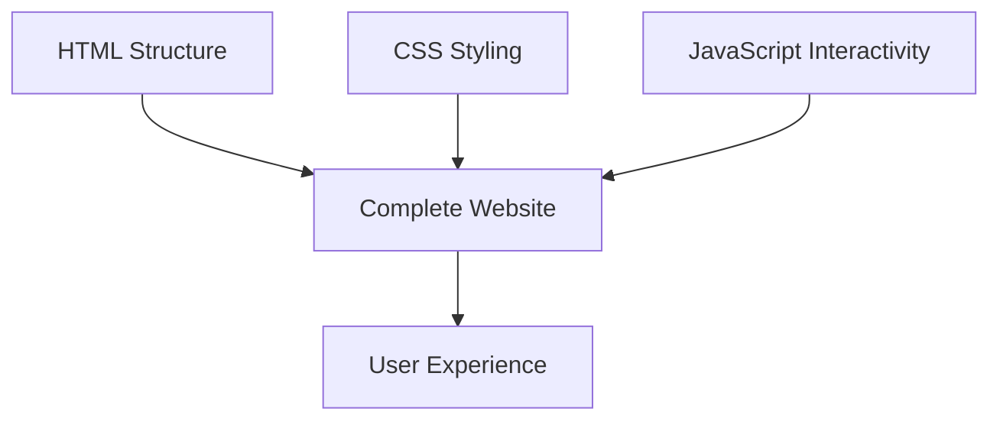

# Day 2: JavaScript Interactivity and DOM Manipulation

## Making Luna's Website Come Alive! ⚡

Building on yesterday's HTML and CSS skills, today you'll add JavaScript to make Luna's website interactive. You'll learn how to respond to clicks, change content dynamically, and connect all three web technologies together!

---

## What You'll Learn Today

### Puzzle Set 3: Connecting HTML to JavaScript
- **The Document Object Model (DOM)**: How JavaScript sees and manipulates HTML
- **getElementById**: Finding specific HTML elements in JavaScript
- **Event Handlers**: Responding to button clicks and user interactions
- **console.log**: Debugging JavaScript (building on Week 2 skills)
- **Changing Content**: Modifying text and HTML with JavaScript

### Puzzle Set 4: Complete Integration
- **Dynamic Styling**: Changing CSS properties with JavaScript
- **State Management**: Keeping track of what's happening in your website
- **Code Patterns**: Recognizing similarities to your rock-paper-scissors game
- **Testing and Debugging**: Using the console to verify your code works

---

## Files in This Folder

- **`index.html`** - Enhanced website with interactive elements and JavaScript connections
- **`styles.css`** - Complete CSS with styling for interactive elements
- **`script.js`** - JavaScript file where you'll add interactivity (your main workspace)
- **`example_output.html`** - Shows the fully interactive website
- **`example_styles.css`** - Complete styling with animations and hover effects
- **`example_script.js`** - Complete JavaScript with all features implemented

---

## Getting Started

### Step 1: Explore the Enhanced HTML
1. Open `index.html` in your browser
2. Notice the new interactive sections:
   - Character buttons that should show character information
   - Theme buttons that should change the website's appearance
   - A contact form with personalized messages
   - A debug section (like your rock-paper-scissors game!)

### Step 2: Connect to Week 2 Learning
Remember your rock-paper-scissors game? This website uses the same patterns:
- **Functions with clear purposes** (like `playRound`, `determineWinner`)
- **Event handling** (responding to button clicks)
- **Console debugging** (using `console.log` to see what's happening)
- **State management** (keeping track of current game/website state)

### Step 3: Open the Console
1. Press F12 to open developer tools
2. Click the "Console" tab
3. You should see welcome messages from the JavaScript file
4. This is where you'll debug and test your code!

---

## Puzzle Set 3 Activities

### Activity 3.1: Understanding the DOM
The DOM is like a family tree of HTML elements that JavaScript can modify:

```javascript
// This finds an HTML element by its ID
const displayElement = document.getElementById("character-display");

// This shows you the element object in the console
console.log("Found element:", displayElement);

// This changes the content inside the element
displayElement.innerHTML = "<p>Hello from JavaScript!</p>";
```

**Try this in the console!**

### Activity 3.2: Your First Interactive Function
Add this function to `script.js`:

```javascript
function showCharacter(characterKey) {
    console.log("🎯 showCharacter called with:", characterKey);

    // Character information (like game choices in rock-paper-scissors)
    const characters = {
        hermia: "Hermia - A brave young woman in love with Lysander",
        puck: "Puck - A mischievous fairy who loves playing tricks",
        bottom: "Bottom - A confident weaver who becomes part of the magic"
    };

    // Get the character info (like determining winner in RPS)
    const characterInfo = characters[characterKey];

    // Update the display (like showing game results)
    const displayElement = document.getElementById("character-display");
    displayElement.innerHTML = `<p>${characterInfo}</p>`;

    console.log("✅ Character updated:", characterInfo);
}
```

**Test it**: Click the character buttons and watch the console!

### Activity 3.3: DOM Object Inspection
Use `console.log` to explore DOM objects (building on Week 2 debugging):

```javascript
function exploreDOM() {
    const element = document.getElementById("character-display");

    console.log("🔍 DOM Element Properties:");
    console.log("- Element type:", element.tagName);
    console.log("- Element ID:", element.id);
    console.log("- Element content:", element.innerHTML);
    console.log("- Element styles:", element.style);
    console.log("- Full element object:", element);
}
```

**Type `exploreDOM()` in the console to see how JavaScript views HTML!**

### Activity 3.4: Event Handler Patterns
Notice how the HTML connects to JavaScript:

```html
<!-- In HTML: -->
<button onclick="showCharacter('hermia')">Hermia</button>

<!-- This calls the JavaScript function showCharacter with the parameter 'hermia' -->
```

This is just like your rock-paper-scissors buttons:
```html
<button onclick="playRound('rock')">Rock</button>
```

**Same pattern, different purpose!**

---

## Puzzle Set 4 Activities

### Activity 4.1: Dynamic Styling with JavaScript
Add this function to change website themes:

```javascript
function changeTheme(themeName) {
    console.log("🎨 Changing theme to:", themeName);

    const body = document.body;

    // Remove old theme classes (like resetting game state)
    body.classList.remove("magical-theme", "forest-theme", "royal-theme");

    // Add new theme class (like updating game state)
    if (themeName !== "default") {
        body.classList.add(themeName + "-theme");
    }

    console.log("✅ Theme changed successfully");
}
```

**Test it**: Try the theme buttons and watch the page transform!

### Activity 4.2: State Management
Keep track of the website's current state (like tracking scores in RPS):

```javascript
// Global state variables (like playerScore, computerScore in RPS)
let currentTheme = "default";
let selectedCharacter = "none";
let debugMode = false;

function updateState(newTheme, newCharacter) {
    currentTheme = newTheme;
    selectedCharacter = newCharacter;

    console.log("📊 Current State:");
    console.log("- Theme:", currentTheme);
    console.log("- Character:", selectedCharacter);
    console.log("- Debug Mode:", debugMode);
}
```

### Activity 4.3: Complete Integration Function
Combine HTML, CSS, and JavaScript in one function:

```javascript
function showPersonalizedMessage() {
    // Get user input (like getting player choice in RPS)
    const nameInput = document.getElementById("visitor-name");
    const visitorName = nameInput.value;

    if (!visitorName) {
        alert("Please enter your name!");
        return;
    }

    // Generate response (like determining winner in RPS)
    const message = `Welcome ${visitorName}! Enjoy our magical play!`;

    // Update display (like showing game results)
    const messageElement = document.getElementById("personal-message");
    messageElement.innerHTML = `<p>🎭 ${message}</p>`;

    // Clear input (like resetting for next round)
    nameInput.value = "";

    console.log("✅ Personalized message created for:", visitorName);
}
```

### Activity 4.4: Debugging and Testing
Create test functions (like `checkMyWork()` in Week 2):

```javascript
function testAllFeatures() {
    console.log("🧪 Testing all website features...");

    // Test character display
    console.log("Testing characters...");
    showCharacter("hermia");

    // Test theme changes
    console.log("Testing themes...");
    changeTheme("magical");

    // Test debug info
    console.log("Current website state:", {
        theme: currentTheme,
        character: selectedCharacter,
        debugMode: debugMode
    });

    console.log("✅ All tests complete!");
}
```

**Type `testAllFeatures()` in the console to test everything!**

---

## Code Pattern Recognition

Notice how this website follows the same patterns as your rock-paper-scissors game:

### Rock-Paper-Scissors Pattern:
```javascript
function playRound(playerChoice) {        // Input parameter
    let computerChoice = getComputerChoice(); // Process
    updateDisplay(playerChoice, computerChoice); // Output
}
```

### Website Pattern:
```javascript
function showCharacter(characterKey) {     // Input parameter
    let characterInfo = getCharacterData(characterKey); // Process
    updateDisplay(characterInfo);          // Output
}
```

**Same structure, different content!**

---

## Advanced Challenges

### Challenge 1: Enhanced Character Display
Modify `showCharacter()` to show more detailed information:

```javascript
const characterData = {
    hermia: {
        name: "Hermia",
        actor: "Sarah Johnson",
        description: "A determined young woman...",
        quote: "The course of true love never did run smooth."
    }
    // Add more characters...
};
```

### Challenge 2: Animation Effects
Add smooth transitions when content changes:

```javascript
function animatedUpdate(element, newContent) {
    element.style.opacity = "0";
    setTimeout(() => {
        element.innerHTML = newContent;
        element.style.opacity = "1";
    }, 200);
}
```

### Challenge 3: Local Storage
Save user preferences between visits:

```javascript
function saveTheme(themeName) {
    localStorage.setItem("preferredTheme", themeName);
}

function loadSavedTheme() {
    const savedTheme = localStorage.getItem("preferredTheme");
    if (savedTheme) {
        changeTheme(savedTheme);
    }
}
```

---

## Debugging Tips

### Common JavaScript Mistakes
1. **Forgetting quotes**: `getElementById(character-display)` should be `getElementById("character-display")`
2. **Case sensitivity**: `getElementById` not `getelementbyid`
3. **Missing semicolons**: Not required but good practice
4. **Console errors**: Always check the Console tab for red error messages

### Using Console for Debugging
```javascript
// Add these throughout your code:
console.log("🔍 Debug checkpoint 1");
console.log("Variable value:", myVariable);
console.log("Function called with:", parameter);
```

### Testing Your Functions
Always test in small pieces:
1. Write one function
2. Test it in the console
3. Fix any errors
4. Move to the next function

---

## Success Criteria

By the end of Day 2, you should have:
- [ ] Successfully connected JavaScript to HTML using `getElementById`
- [ ] Created at least 3 interactive functions
- [ ] Used `console.log` for debugging and exploration
- [ ] Changed both content (innerHTML) and styling (classList) with JavaScript
- [ ] Recognized the pattern similarities to your rock-paper-scissors game
- [ ] Created functions that follow the input → process → output pattern
- [ ] Successfully tested your functions in the browser console

---

## Integration Summary

You've now learned how the three web technologies work together:

1. **HTML** provides the structure (skeleton)
2. **CSS** provides the styling (appearance)
3. **JavaScript** provides the interactivity (behavior)



This is the foundation of ALL web development! 🎉

---

## Next Steps

For homework, you'll apply these skills to enhance your rock-paper-scissors game:
- Add CSS styling to make it beautiful
- Improve the JavaScript with better visual feedback
- Create a polished game that showcases your new skills

---

## Resources

- [MDN JavaScript Reference](https://developer.mozilla.org/en-US/docs/Web/JavaScript/Reference)
- [MDN DOM Manipulation Guide](https://developer.mozilla.org/en-US/docs/Learn/JavaScript/Client-side_web_APIs/Manipulating_documents)
- [JavaScript Console Methods](https://developer.mozilla.org/en-US/docs/Web/API/Console)
- [HTML Event Attributes](https://developer.mozilla.org/en-US/docs/Web/HTML/Attributes#event_handler_content_attributes)

Remember: JavaScript is just like the logic you learned in Week 2, but now it can change what users see and interact with! Focus on understanding the patterns and don't worry about memorizing syntax. 🚀